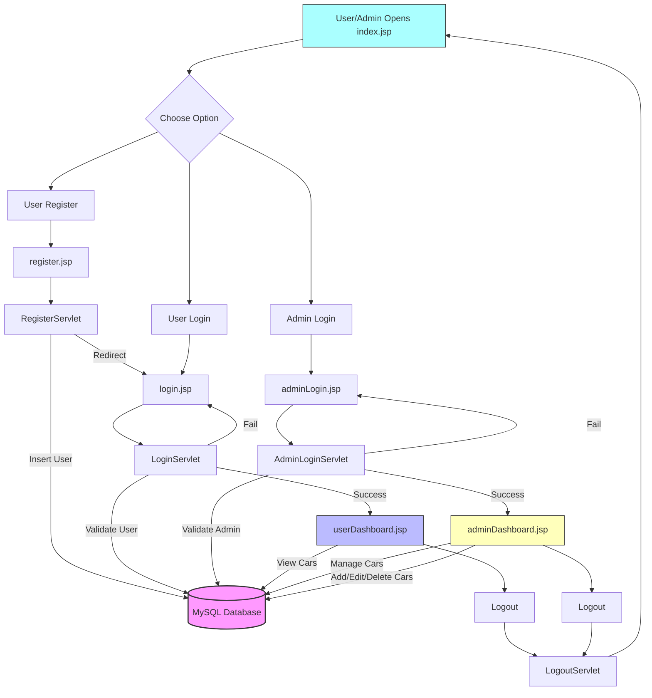

# 🚗 Car Rental System - Mini Project

## 📚 Course
**Advanced Internet Programming**  
**Semester**: 2nd Semester  
**Project Type**: Mini Project  
**Developed By**: Abhijeet Prajapati  
**College**: CHandigarh University

---

## 📌 Project Overview

This is a **web-based Car Rental System** developed using **Java, JSP, Servlets, JDBC**, and **MySQL**. It allows users to register, log in, and view available cars, while providing an admin panel to manage cars (Add/Edit/Delete). It demonstrates session management, database interaction, and modular architecture using servlets and JSPs.

---

## 🎯 Features

### 👤 User Module
- Register new users
- Login with session tracking
- View available cars
- Logout

### 🛠️ Admin Module
- Admin login
- Dashboard to manage car listings
- Add new cars
- Edit car details
- Delete cars
- Logout

---

## 🧰 Technologies Used

| Technology        | Description                       |
|------------------|-----------------------------------|
| Java             | Backend programming language      |
| JSP & Servlets   | Frontend & Controller             |
| MySQL            | Relational Database               |
| JDBC             | Java Database Connectivity        |
| Apache Tomcat    | Servlet Container (localhost)     |
| HTML, CSS        | Styling and basic layout          |
| NetBeans         | IDE for development               |

---

## 🗃️ Project Structure

